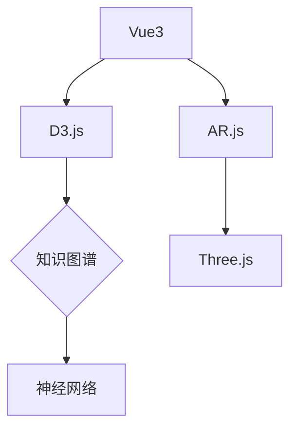

# smc_web

## 项目简介

SMC Web 是一个使用 Next.js 框架开发的深圳大学传播学院网站。该网站参考了萌娘百科，深圳大学传播学院官网的设计风格，包含多个功能页面，例如教师展示、本科生信息等，旨在为用户提供学校相关信息的便捷访问。

## 功能特点

- 教师信息展示（包含照片、职称、研究领域等）
- 本科生相关信息
- 学校简介
- 响应式设计，支持多种设备浏览

## 安装指南

### 前置条件

在开始之前，请确保你的电脑上已安装以下软件：

1. **Node.js** (版本 14.0 或更高，推荐18.20.7)
   - 访问 [Node.js 官网](https://nodejs.org/zh-cn/)
   - 下载并安装适合你操作系统的安装包
   - 安装完成后，打开命令提示符或终端，输入 `node -v` 和 `npm -v` 确认安装成功

### 下载项目

**方法：直接下载**

1. 访问项目仓库网页
2. 点击"下载"或"Download ZIP"按钮
3. 解压下载的文件到你想要的位置

### 安装依赖

1. 打开命令提示符或终端
2. 进入项目文件夹：
   ```
   cd 你的项目路径/smc_web
   ```
3. 安装所需依赖：
   ```
   npm install
   ```
4. 等待安装完成（这可能需要几分钟时间）

5. 需要解压位于node_modules/@next/swc-win32-x64-msvc/next-swc.win32-x64-msvc.zip的压缩包到当前文件夹

## 使用说明

### 启动项目

1. 在命令提示符或终端中，确保你在项目文件夹内（web_smc这个文件夹中）
   ```
   cd 你的项目路径/smc_web
   ```
2. 输入以下命令启动开发服务器：
   ```
   npm run dev
   ```
3. 等待几秒钟，直到看到类似下面的提示：
   ```
   ready - started server on 0.0.0.0:3000, url: http://localhost:3000
   ```
4. 打开你的浏览器，访问 http://localhost:3000

### 浏览网站功能

项目启动后，你可以浏览以下页面：

- **首页**: http://localhost:3000
- **关于我们**: http://localhost:3000/about
- **教师信息**: http://localhost:3000/faculty
- **本科生信息**: http://localhost:3000/undergraduate

### 教师信息页面

在教师信息页面，你可以：
- 查看所有教师的基本信息
- 点击教师卡片查看详细信息
- 浏览教师的研究领域和评价

## 常见问题解答

### 问题1: 运行 `npm install` 时出现错误

**解决方法**:
- 确保你的 Node.js 版本兼容（推荐 14.0 以上）
- 尝试使用管理员权限运行命令提示符或终端
- 如果网络受限，可以尝试设置 npm 镜像：
  ```
  npm config set registry https://registry.npmmirror.com
  ```
  然后重新运行 `npm install`

### 问题2: 网站无法访问

**解决方法**:
- 确保开发服务器正在运行
- 检查命令提示符或终端中是否有错误信息
- 确认你访问的是正确的地址 (http://localhost:3000)
- 尝试使用其他浏览器

### 问题3: 页面显示不正常

**解决方法**:
- 刷新页面
- 清除浏览器缓存
- 确保你已安装所有依赖 (`npm install`)


## 技术支持

项目负责人：S1mo
第二作者：Kuan、Yanyu

如有任何问题，请联系项目维护人员S1mo，邮箱：chent555888@outlook.com或在仓库中提交 Issue。

祝你使用愉快！


## 作者碎碎念

做个小小的网站送给自己，纪念自己2022-2026在深圳大学传播学院的四年求学时光，为自己四年本科课程修读画上一个完美的句号，感谢每一位学院老师的辛勤教诲，还要特别感谢我工作中的恩师Jordan，带我进入了计算机行业成为一名小小的程序员。


网站里包含了很多自己的主观想法和评价，也就是图一乐的想法而已不用太较真，如果侵犯了您的权利请联系我。


```markdown

<div align="center">
 
```diff 
+------------------------------------------------------------------+
| ░█▀▀░█░░░█▀█░█▀▀░█▀▄░▀█▀░█▀█░█▀▄░░░░░░░░░░░░░░░░░░░░░░░░░░░░░░░░░ |
| ░█▀▀░█░░░█▀█░█▀▀░█▀▄░░█░░█░█░█▀▄░░░深圳大学传播学院2022级纪念工程░ |
| ░▀░░░▀▀▀░▀░▀░▀▀▀░▀░▀░▀▀▀░▀░▀░▀░▀░░░░░░░░░░░░░░░░░░░░░░░░░░░░░░░░░ |
+------------------------------------------------------------------+


</div>

# 🌌 二进制编织的人文经纬

> "传播是人类的操作系统，代码是数字时代的修辞学" —— 致谢Jordan老师

## 🚀 即刻启程

```bash
# 克隆时空胶囊
git clone https://github.com/你的用户名/项目名.git

# 注入记忆燃料
npm install && npm run dev
```

## 🌠 核心记忆模块

<table>
  <tr>
    <td width="50%">

### 📚 理论实验室
```markdown
[](./memories)
```
- 沉默的螺旋 ⇌ 情感分析折线图
- 媒介环境学派 ⇌ 网络拓扑结构
- 文化工业 ⇌ 推荐算法可视化
    </td>
    <td width="50%">

### 💻 代码修道院
```javascript
// Jordanism.module.js
export const teachings = [
  "代码缩进是程序员的呼吸节奏", 
  "在commit message里写微型小说",
  "BUG是编译器写给你的俳句"
];
```
[](https://github.com/你的用户名)
    </td>
  </tr>
</table>

## 🌍 记忆考古现场

### 1. 荔园咖啡渍地图
```diff
+ 传播学院机房C302 ██████████ 92% (首次完成话题聚类分析)
+ 计软实验室B415   ████████▎ 85% (习得递归的哲学)
+ 文科楼天台       ███▎     32% (顿悟文理月光同源)
```

### 2. AR教材解密
[](https://你的演示链接)
- 实体书页中生长数据根系
- 重点批注变成LED信号塔
- 扫码收听Jordan的隐藏课程

## 🕰️ 时光虫洞协议

```python
# time_capsule.py
def send_to_future():
    while True:
        current_year = datetime.now().year
        if current_year >= 2030:
            send_email(
                to="future_me@domain.com",
                subject=f"来自{current_year-4}年的二进制漂流瓶",
                body=render_memory_fragments()
            )
            break
        time.sleep(60*60*24*365)  # 每年检查一次
```

## 📜 开发手札

<table>
  <tr>
    <th>日期</th>
    <th>里程碑</th>
    <th>顿悟时刻</th>
  </tr>
  <tr>
    <td>2024.03</td>
    <td>记忆坐标系V1</td>
    <td>发现实验室坐标(x,y)对应传播学理论页码</td>
  </tr>
  <tr>
    <td>2024.04</td>
    <td>文理折叠实验</td>
    <td>用CSS Grid实现麦克卢汉⇄Python的双向翻译</td>
  </tr>
</table>

## 🌃 数字人类学田野笔记

```
  荔园夜行记 · 癸卯年十月十五
  --------------------------
  机房的空调低声哼着巴赫平均律
  Python进程在后台编译月光
  当马尔库塞遇见Matplotlib
  单向度社会在散点图中显形
```

## 📮 给2030年的数字人类学家

```diff
+-----------------------------------------------+
| 当你打开这时光胶囊时：                       |
| - 传播学院咖啡机密码仍是2012级入学年份       |
| - Jordan老师的保温杯刻着"Hello World!"       |
| - 文山湖黑天鹅喜欢啄取快递袋的声音           |
| - 你的人生代码不要留"//TODO: 待完善"         |
+-----------------------------------------------+
```

## 🛸 参与这场时空实验

```diff
+ 创建记忆分支：
  git checkout -b memory/你的名字-记忆关键词

+ 在/docs/poetry下用代码写一首记忆之诗

+ 发起PR时附上一个校园故事
```

<details>
<summary>🛠️ 技术宇宙图景（点击展开）</summary>

### 星际航行技术栈


### 时空曲率引擎
| 模块             | 技术方案                          | 理论映射                   |
|------------------|-----------------------------------|---------------------------|
| 记忆折叠         | WebGL GLSL着色器                  | 麦克卢汉的媒介延伸论       |
| 时光涟漪         | CSS滚动驱动动画                   | 海德格尔的时间性          |
| 认知虫洞         | GraphQL + Neo4j                   | 福柯的知识考古学          |
</details>

---

<div align="center">

[](https://creativecommons.org/licenses/by-nc-sa/4.0/)  
`Jordan特别条款：允许在代码注释中使用电影台词作为文档规范`

</div>
```

---

### 使用说明：
1. 替换以下占位内容：
   - `你的用户名` → 您的GitHub用户名
   - `https://你的演示链接` → 实际部署地址
   - 占位图片URL → 实际项目截图

2. 在`开发手札`部分持续添加开发日志

3. 实际功能模块需要：
   - 在`/memories`目录存放记忆碎片
   - 在`/docs/poetry`目录存放代码诗
   - 实现AR扫描功能后更新链接
